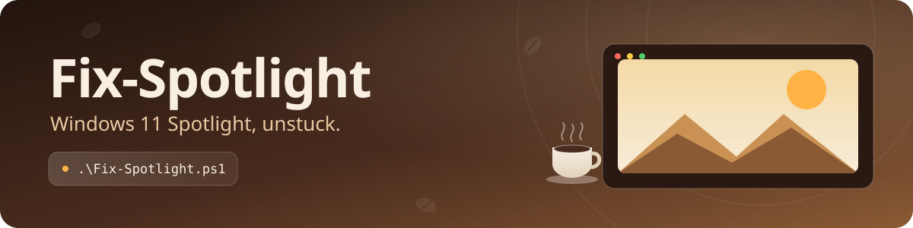
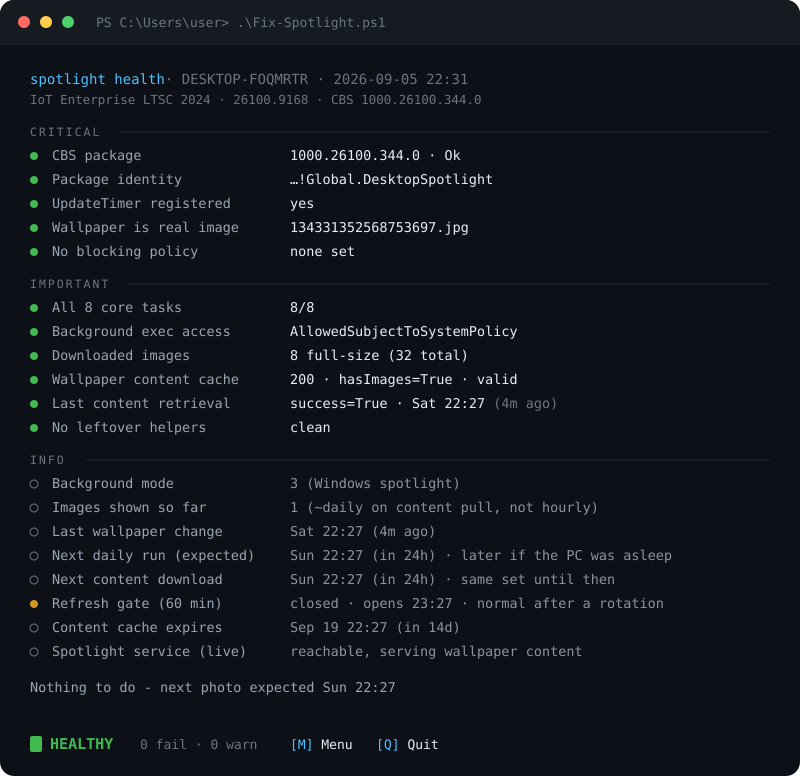

<p align="center">
  
</p>

<p align="center">
  <b>Stuck on <code>image_3.jpg</code>? Great bamboo. 40 days of bamboo. Enough.</b>
</p>

<p align="center">
  
  
</p>

You picked **Windows spotlight** and expected a new photo every day. You got one picture that never changes — whether it stopped or never started, it's the same fault, and that picture is a placeholder Windows ships in the box. `Fix-Spotlight` puts the missing piece back, and can tell you at a glance how healthy Spotlight is on any machine.

One file, pure PowerShell, no dependencies. It needs **no administrator rights**, and its health check changes **nothing**.

## 😖 What goes wrong

Behind the scenes, the desktop-Spotlight wallpaper is fetched by a handful of **background tasks** that live inside a Windows system package (`MicrosoftWindows.Client.CBS`). When those task registrations get dropped — most often by a well-meaning *"reset & re-register the Spotlight app"* repair that tears the package down without putting the tasks back — nothing is left to go fetch a picture. Windows quietly falls back to a wallpaper it ships in the box:

```
C:\Windows\SystemApps\MicrosoftWindows.Client.CBS_...\DesktopSpotlight\Assets\Images\image_2.jpg
```

…and there it sits. The catch is that those tasks can only be re-created by code running **inside** the package's own identity — which is exactly why the usual `Add-AppxPackage -Register` / `Reset-AppxPackage` dance doesn't bring them back. `Fix-Spotlight` does it the way Windows itself would.

## ✨ Three commands

```powershell
# 1) See how Spotlight is doing — read-only, changes nothing
powershell -ExecutionPolicy Bypass -File .\Fix-Spotlight.ps1 -HealthCheck

# 2) Fix it  (takes 15-30 min - it schedules Windows' own timer and waits for the new photo)
powershell -ExecutionPolicy Bypass -File .\Fix-Spotlight.ps1

# 3) Fix it even if the tasks look present but the wallpaper is still stuck
powershell -ExecutionPolicy Bypass -File .\Fix-Spotlight.ps1 -Force
```

> **Heads-up:** run these in **Windows PowerShell 5.1** (`powershell.exe`) — not PowerShell 7 (`pwsh`). The magic relies on Windows' built-in WinRT projection, which only 5.1 has. No admin prompt; everything runs as you.

### ⚡ Or run it straight from GitHub

No download needed — paste into a Windows PowerShell 5.1 window:

```powershell
# 1) See how Spotlight is doing — read-only, changes nothing
iex "& { $(irm https://raw.githubusercontent.com/cottonella/fix-spotlight/main/Fix-Spotlight.ps1) } -HealthCheck"

# 2) Fix it
irm https://raw.githubusercontent.com/cottonella/fix-spotlight/main/Fix-Spotlight.ps1 | iex

# 3) Fix it even if the tasks look present but the wallpaper is still stuck
iex "& { $(irm https://raw.githubusercontent.com/cottonella/fix-spotlight/main/Fix-Spotlight.ps1) } -Force"
```

The plain `irm … | iex` form runs the repair; to pass a switch, use the `iex "& { … } -Switch"` form. Either way the script returns to your prompt when it's done (it won't close your window) and leaves the verdict in `$LASTEXITCODE`.

Make sure Spotlight is actually selected first: **Settings → Personalization → Background → Windows spotlight**. The tasks only do their work while it's the chosen background.

## 🩺 What healthy looks like

`-HealthCheck` prints a tidy, colour-coded readout and an overall verdict — green when all is well, amber for **DEGRADED**, red for **BROKEN** — plus an exit code (`0` / `1` / `2`) so you can fold it into fleet scripting.

<p align="center">
  
</p>

Every timestamp carries a friendly *"(15h ago)"* so you can spot a stall at a glance, and the header stamps the edition, build, and CBS version — so a report pasted from any machine identifies itself.

## 🎛️ Commands &amp; flags

| Flag                  | What it does                                                                                                                                      |
| --------------------- | ------------------------------------------------------------------------------------------------------------------------------------------------- |
| *(none)*              | **Repair.** Register the tasks in-package, schedule a one-shot fetch, and wait for the new wallpaper to land (usually 15–30 min, progress shown). |
| `-HealthCheck`        | **Read-only report** + verdict. Alias: `-DiagnoseOnly`. Exit `0` healthy · `1` degraded · `2` broken.                                             |
| `-Force`              | Do the repair even when the tasks already exist — for the "registered but still stuck on the placeholder" case, or simply to get a new photo now. |
| `-CleanLockScreenPin` | Remove a static lock-screen image pinned by a third-party app (the removed values are printed first).                                             |

## 🔍 What it checks

The verdict is scored only on things that actually deliver your wallpaper — no false alarms from Windows values that merely *look* odd but are perfectly normal.

- **Critical** — the CBS package, the in-package identity, the `UpdateTimer` task, a real (non-placeholder) wallpaper, and that no Group Policy / MDM rule is blocking Spotlight.
- **Important** — all 8 core background tasks, background-execution permission, downloaded images on disk, a valid content cache, a successful last fetch, and no leftover repair helpers.
- **Info** *(never scored)* — background mode, images shown so far, last-change and cache-expiry times with relative ages, **when the next rotation and the next content download are expected**, whether a fetch is currently scheduled, and whether Microsoft's content endpoint is reachable.
- **The refresh gate** gets its own treatment: it shows **amber whenever it's closed** (with the time it opens) so you don't waste a `-Force` run, but it only counts against the verdict when the desktop is still on the placeholder — a healthy machine is gated for 60 minutes after every rotation, and that's not a problem.

## ⚙️ How it works (the short tour)

`Invoke-CommandInDesktopPackage` lets the script run a snippet of PowerShell **under the CBS package's identity** — the one context where the Spotlight task classes actually resolve. The snippet is delivered as an `-EncodedCommand` and its output comes back over a **named pipe**.

Inside that identity it registers the tasks with the ordinary WinRT `BackgroundTaskBuilder`, then schedules **one extra, one‑shot 15‑minute `TimeTrigger`** on `DesktopSpotlight.BackgroundTask.UpdateTimer`. Windows runs the real task itself within about **15–30 minutes** (15 min is the floor for time triggers, and Windows aligns them coarsely); that run wakes `BackgroundTaskManager`, which **re-registers CBS's whole task set itself** and pulls down a fresh batch of wallpapers. The one‑shot removes itself afterwards. From there Windows takes over: the timer refreshes about **once a day**, and a `RegistrationStatusCheck` at each sign-in keeps everything tidy.

Why a timer and not an instant trigger? Because the instant one doesn't work here: an `ApplicationTrigger` on this entry point is *accepted* by Windows (`RequestAsync → Allowed`) and then never actually runs — an ETW trace shows zero task activity every time. The entry point is declared for timer/system triggers only. The script uses the trigger Windows itself uses.

One rule of Windows' the script respects rather than overrides: `UpdateTimer` **ignores any run within 60 minutes of the last wallpaper touch** (`WallpaperRefresh` / `Rotation` under `HKCU\…\DesktopSpotlight` — the value comes from DesktopSpotlight's own trace, `s_rotationPeriod=60`). Spotlight's own maintenance task re-applies the current picture now and then and restamps that clock. So if the gate is closed the script tells you exactly when it opens and asks you to run it again after that — it never rewrites those timestamps.

## 🔬 Curious how we know all this?

Everything above was worked out by comparing a broken machine with a healthy one and tracing what Windows actually does. The full write-up lives in **[FINDINGS.md](FINDINGS.md)**.

## 🛟 Is it safe?

- **`-HealthCheck` is strictly read-only** — it inspects and reports, and touches nothing.
- **The fix only adds the background-task registrations Windows itself would have created.** No files deleted, no system settings changed, no admin rights.
- **No phoning home** — the only network touch is an optional 3-second reachability probe to Microsoft's own Spotlight endpoint, shown as info.
- **Self-cleaning &amp; reversible** — the one extra registration it makes is a one-shot timer that removes itself after it runs; the tasks it adds are the stock ones. It never rewrites Spotlight's timestamps or clears its cache.

That being said, you run the script at your own risk.

## 💻 Requirements

- **Windows 11** (24H2+).
- **Windows PowerShell 5.1** (`powershell.exe`) — not `pwsh` 7.
- **No administrator rights.**
- Desktop background set to **Windows spotlight**.

## ❓ FAQ

<details>
<summary><b>The health check said <code>0 tasks</code> right after I signed in!</b></summary>

That's a known quirk: for a minute or so after logon, Windows hasn't re-surfaced the task list to a fresh process yet. The script already waits and re-checks once — but if you catch it at exactly the wrong moment, just run it again in half a minute.
</details>

<details>
<summary><b>Why does the fix take 15–30 minutes?</b></summary>

Because it hands Windows a one-shot background timer and Windows runs it on its own schedule — **15 minutes is the floor** for background timers, and they're aligned coarsely, so it lands somewhere in that window. The script waits and shows a line every minute; Ctrl+C is safe (the timer stays scheduled), and so is locking the screen or walking away — nothing you do at the desktop disturbs the scheduled run.
</details>

<details>
<summary><b>It's fixed, but the wallpaper didn't change after an hour.</b></summary>

That's expected — desktop Spotlight refreshes roughly **once a day** when it pulls new content, not every hour. A green **HEALTHY** with the wallpaper still on today's image is completely normal; tomorrow's photo arrives on the daily timer.
</details>

<details>
<summary><b>It says the refresh gate is closed. What's that?</b></summary>

Windows won't rotate the desktop within **60 minutes** of the last time it touched the wallpaper — and Spotlight's own maintenance task counts as a touch when it re-applies the current picture. The script reads the timestamp, tells you the exact time the gate opens, and leaves it to Windows rather than rewriting it. Just run it again after that time. Locking the screen, signing out and back in, or rebooting don't move the gate (verified) — only Spotlight's own tasks do.
</details>

<details>
<summary><b>What about the lock-screen Spotlight?</b></summary>

Different feature, different plumbing — and on LTSC / IoT editions the lock screen doesn't even offer Spotlight, so there's nothing to fix there. `Fix-Spotlight` is about the **desktop wallpaper**.
</details>

<details>
<summary><b>Will it stay fixed after a reboot or a Windows update?</b></summary>

Background-task registrations persist, and the sign-in check keeps them healthy, so a reboot is fine. If some future servicing operation ever wipes them again, just run the fix once more — that's what it's for.
</details>

## ☕ License

**[Coffee-Ware](LICENSE).** Keep the notice, and otherwise do whatever you want with it. Provided as-is, no warranty. If it brought your wallpapers back and you'd like to say thanks, the nicest way is a coffee: **[ko-fi.com/cottonella](https://ko-fi.com/cottonella)** ☕

---

<p align="center">
  &nbsp;
  <a href="https://ko-fi.com/cottonella"></a>
</p>
